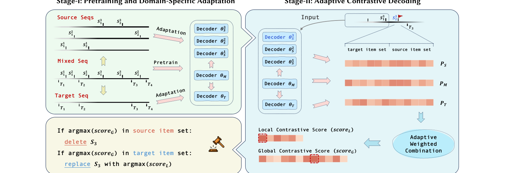
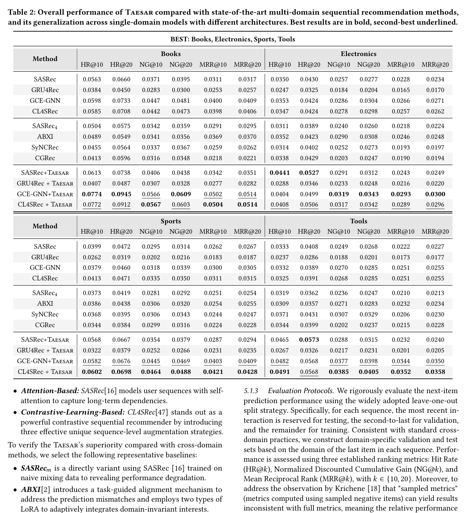
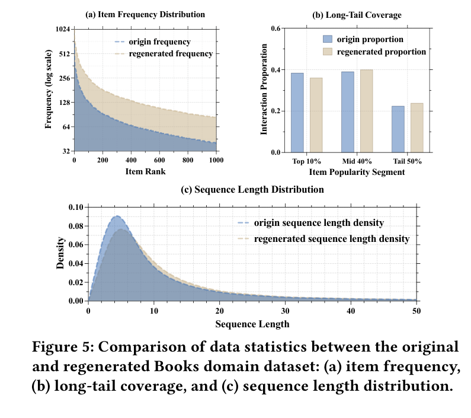

# Generative Data Transformation: From Mixed to Unified Data

[](https://ustc-starteam.github.io/Taesar/)
[](https://www2026.thewebconf.org/)
[](https://pytorch.org/)
[](https://hydra.cc/)

Official implementation of **"Generative Data Transformation: From Mixed to Unified Data"**.

Taesar is a data-centric framework for target-aligned sequential regeneration. It addresses the domain gap in multi-domain sequential recommendation by regenerating target-aligned sequences with adaptive contrastive decoding, allowing standard sequential models to benefit from cross-domain context without relying on increasingly complex model-centric fusion architectures.

## 1. Paper

Jiaqing Zhang, Mingjia Yin, Hao Wang, Yuxin Tian, Yuyang Ye, Yawen Li, Wei Guo, Yong Liu, and Enhong Chen. **Generative Data Transformation: From Mixed to Unified Data.** In *Proceedings of the ACM Web Conference 2026 (WWW '26)*, April 13-17, 2026, Dubai, United Arab Emirates.

[Paper](https://arxiv.org/abs/2602.22743) / [PDF](https://arxiv.org/pdf/2602.22743) / [Project Page](https://ustc-starteam.github.io/Taesar/) / [Citation](#citation)

Taesar is a data-centric framework for target-aligned sequential regeneration. It transforms mixed-domain user behavior into target-aligned training sequences through tri-model pretraining and adaptive contrastive decoding, helping standard sequential recommenders use cross-domain data without complex fusion architectures.

## 2. Highlights

- Proposes **Taesar**, a target-aligned sequential regeneration framework for multi-domain recommendation.
- Uses tri-model pretraining and domain-specific adaptation to separate mixed-domain, source-domain, and target-domain knowledge.
- Applies adaptive contrastive decoding to transform mixed sequences into target-aligned training data.
- Generalizes across multiple sequential recommendation backbones and improves both data-centric and model-centric baselines.

## 3. Method At A Glance



Taesar first trains mixed, source, and target decoder views, then uses adaptive contrastive decoding to decide which source-domain items should be deleted or replaced with target-aligned items. The regenerated sequence data can then be used by standard sequential recommendation models.

## 4. Repository Structure

```text
.
|-- config/                         # Hydra configuration files
|-- data/                           # Dataset and sequential data loaders
|-- dataset/                        # Raw data folder and preprocessing notebooks
|-- model/                          # Sequential model implementation
|-- cdsr_baseline/                  # Baseline implementations for comparison
|-- pretrain.py                     # Stage-I pretraining entry point
|-- decoding.py                     # Stage-II adaptive contrastive decoding
|-- finetune.py                     # Fine-tuning/evaluation entry point
|-- trainer.py                      # Training utilities
|-- run.sh                          # End-to-end example script
|-- environment.yml                 # Conda environment
|-- docs/assets/                    # README figures cropped from the paper
`-- README.md
```

## 5. Installation

```bash
conda env create --name Taesar --file environment.yml
conda activate Taesar
```

The environment includes PyTorch, Hydra, RecBole-related dependencies, W&B, and plotting utilities. Use a CUDA-enabled machine for full experiments.

## 6. Data

Download the raw Amazon datasets:

```bash
cd dataset/raw/
gdown 'https://drive.google.com/uc?id=1Y7bvGSeWZ7TjGx5qA-4n59a457IpvQLO'
gdown 'https://drive.google.com/uc?id=1ogT75lYJ4fd0vNyhP1a7Kq8SC1fYBa6Y'
gdown 'https://drive.google.com/uc?id=1VJ2qx8mHi2nhyEVkoEv-3YQ5ZraG7cNs'
gdown 'https://drive.google.com/uc?id=1JdqI7sosDmqU13ZXhz1Z0rRiIOm-5hT5'
unzip Amazon_Books.zip
unzip Amazon_Electronics.zip
unzip Amazon_Sports_and_Outdoors.zip
unzip Amazon_Tools_and_Home_Improvement.zip
```

Process datasets with the notebooks under `dataset/`, especially `dataset/to_taesar.ipynb` for Taesar-format data.

## 7. Quick Start

Run the provided end-to-end script:

```bash
bash run.sh
```

The script executes pretraining, adaptive contrastive decoding for each target domain, and fine-tuning with `new`, `sim`, and `full` training modes.

## 8. Reproducing Paper Results

The same workflow can be run stage by stage:

```bash
python pretrain.py -m stage=run gpu_id=0 seed=2025
python decoding.py -m stage=dec gpu_id=0 seed=2025 target_dom=dom1 train_batch_size=32
python finetune.py -m stage=tun gpu_id=0 seed=2025 train_type=new target_dom=dom1
python finetune.py -m stage=tun gpu_id=0 seed=2025 train_type=sim target_dom=dom1
python finetune.py -m stage=tun gpu_id=0 seed=2025 train_type=full target_dom=dom1
```

Repeat decoding and fine-tuning for `dom1`, `dom2`, `dom3`, and `dom4`.

## 9. Configuration Notes

Main settings are in `config/overall.yaml`:

- `stage`: `run`, `dec`, or `tun`
- `dataset`: default `BEST`
- `target_dom`: `dom1`, `dom2`, `dom3`, or `dom4`
- `train_type`: `new`, `sim`, or `full`
- `valid_metric`: default `NDCG@10`
- `topk`: `[5, 10, 20, 50, 100]`

Model-specific settings live under `config/model/`.

## 10. Experimental Highlights



Taesar improves multiple sequential backbones across the BEST domains, showing that target-aligned regenerated data can complement both standard single-domain models and multi-domain baselines.



The regenerated data better matches target-domain frequency, long-tail coverage, and sequence-length statistics, which supports the paper's data-centric explanation for the performance gains.

## 11. Notes For Maintainers

- Keep `run.sh` synchronized with the stage names and defaults in `config/overall.yaml`.
- If you rename the environment file, update the installation command in this README at the same time.
- Store README-ready paper figures under `docs/assets/`; keep raw experiment outputs in their run directories.

<a id="citation"></a>

## 12. Citation

```bibtex
@inproceedings{zhang2026generative,
  title = {Generative Data Transformation: From Mixed to Unified Data},
  author = {Zhang, Jiaqing and Yin, Mingjia and Wang, Hao and Tian, Yuxin and Ye, Yuyang and Li, Yawen and Guo, Wei and Liu, Yong and Chen, Enhong},
  booktitle = {Proceedings of the ACM Web Conference 2026},
  series = {WWW '26},
  year = {2026},
  doi = {10.1145/3774904.3792124}
}
```

## 13. Contact

For first-author questions, contact Jiaqing Zhang at `jiaqing.zhang@mail.ustc.edu.cn`. For correspondence, contact Hao Wang at `wanghao3@ustc.edu.cn` or Enhong Chen at `cheneh@ustc.edu.cn`. For repository issues, please open a GitHub issue in this repository.
